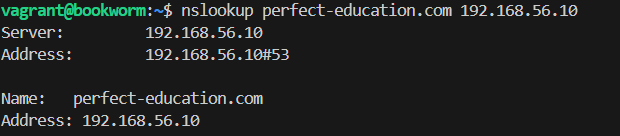

# Server Configuration Guide

### 1. Introduction

This guide details the steps to configure and secure a web server using DNS and Nginx. Each section provides instructions alongside references to images for better understanding.

### 8. Safe Access with Nginx

#### **Prerequisites**

Set up a DNS server with the following features:

- A record pointing `perfect-education.com` to your server's IP address.
- A record pointing `www.perfect-education.com` to your server's IP address.

#### **Steps**

1. **Install BIND9**

   ```bash
   sudo apt install bind9
   ```

2. **Modify the main config file**

   ```bash
   sudo nano /etc/bind/named.conf.local
   ```

   Add the following:

   ```bash
   zone "perfect-education.com" {
       type master;
       file "/etc/bind/db.perfect-education.com";
   };
   ```

3. **Create the zone file for the domain**

   ```bash
   sudo nano /etc/bind/db.perfect-education.com
   ```

   Paste the configuration below:

   ```text
   ; BIND data file for local loopback interface
   ;
   $TTL 6048000
   @ IN SOA perfect-education.com. admin-perfect.education.com. (
       2024112201 ; Serial
       604800 ; Refresh
       86400 ; Retry
       2419200 ; Expire
       604800 ) ; Negative Cache TTL

   @ IN NS perfect-education.com.
   perfect-education.com. IN A 192.168.56.10
   www.perfect-education.com. IN A 192.168.56.10
   ```

4. **Check configuration**
   Run the following commands to validate your DNS settings:

   ```bash
   sudo named-checkconf
   sudo named-checkzone perfect-education.com /etc/bind/db.perfect-education.com
   ```

   
   

5. **Restart BIND**
   ```bash
   sudo systemctl restart bind9
   ```

#### 8.1 **Nginx Configuration**

1. Create the configuration file for your domain:

   ```bash
   sudo nano /etc/nginx/sites-available/example.com
   ```

2. Set the `server_name` directive:

   ```nginx
   server {
       ...
       server_name example.com www.example.com;
   }
   ```

3. Check and reload Nginx:
   ```bash
   sudo nginx -t
   sudo systemctl reload nginx
   ```
   

#### 8.2 **Firewall Configuration**

1. Install UFW:

   ```bash
   sudo apt install ufw
   ```

2. Enable and configure UFW:

   ```bash
   sudo ufw enable
   sudo ufw allow ssh
   sudo ufw allow 'Nginx Full'
   sudo ufw delete allow 'Nginx HTTP'
   ```

3. Check UFW status:
   ```bash
   sudo ufw status
   ```
   

#### 8.3 **Certificate Generation**

Generate the SSL certificate:

```bash
sudo openssl req -x509 -nodes -days 365     -newkey rsa:2048     -keyout /etc/ssl/private/perfect-education.com.key     -out /etc/ssl/certs/perfect-education.com.crt
```


#### 8.4 **SSL Configuration**

Modify the Nginx config file to include SSL settings:

```nginx
server {
    listen 80;
    listen 443 ssl;
    root /var/www/perfect_education_website/html;
    index index.html index.htm index.nginx-debian.html;
    server_name perfect-education.com www.perfect-education.com;

    ssl_certificate /etc/ssl/certs/example.com.crt;
    ssl_certificate_key /etc/ssl/private/example.com.key;
    ssl_protocols TLSv1 TLSv1.1 TLSv1.2 TLSv1.3;
    ssl_ciphers HIGH:!aNULL:!MD5;

    location / {
        try_files $uri $uri/ =404;
    }
}
```

Check and reload Nginx:

```bash
sudo nginx -t
sudo systemctl reload nginx
```


#### 8.5 **Verify Domain**

Access the following URLs to ensure proper configuration:

- http://perfect-education.com
- http://www.perfect-education.com


