# Nginx Web Server and FTPS Configuration on Debian with Vagrant

## 📖 Overview

This repository provides a comprehensive guide for setting up a Debian-based Nginx web server and FTPS service within a Vagrant-managed virtual machine. The project includes:

- Setting up two websites (`my_site` and `new_site`) with Nginx.
- Secure file transfer using FTPS.
- Proper directory structure and permission configuration.
- Debugging logs and troubleshooting common issues.

## 📋 Requirements

Ensure the following tools are installed on your local machine:

- [Vagrant](https://www.vagrantup.com/)
- [VirtualBox](https://www.virtualbox.org/) (or another Vagrant-compatible provider)
- [Git](https://git-scm.com/) for cloning repositories

---

### 6️⃣ Authentication

#### 6.1 Install OpenSSL

Verify that OpenSSL is installed on your system:

```bash
dpkg -l | grep openssl
```

#### 6.2 Create Users and Passwords

1. Create a hidden `.htpasswd` file inside `/etc/nginx` to store users and passwords:

   ```bash
   sudo htpasswd -c /etc/nginx/.htpasswd
   ```

2. Create a user named `Paula`:

   ```bash
   sudo sh -c "echo -n 'Paula:' >> /etc/nginx/.htpasswd"
   ```

3. Generate a password for the user:

   ```bash
   sudo sh -c "openssl passwd -apr1 'yourpassword' >> /etc/nginx/.htpasswd"
   ```

Two users were created successfully and verified as follows:

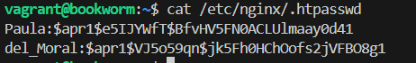

#### 6.3 Modify the Server Block

Update the server block to include basic authentication (pew_basic_autentication):

```nginx
server {
    listen 80;
    listen [::]:80;
    root /var/www/perfect_education_website/html;
    index index.html index.htm index.nginx-debian.html;
    server_name perfect_education_website;

    location / {
        auth_basic "Área restringida";
        auth_basic_user_file /etc/nginx/.htpasswd;
        try_files $uri $uri/ =404;
    }
}
```

---

### 7️⃣ Tasks

#### T1: Test User Authentication

1. Attempt to log in with an incorrect user first, then with a valid user.

   - Successful access:
     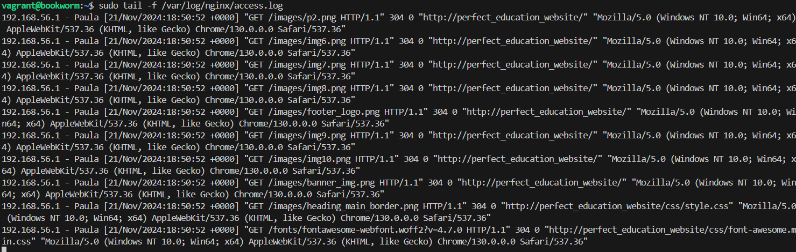
   - Access denied:
     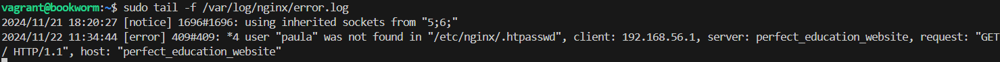

2. Verify the logs for access and error details using the following commands:

   ```bash
   sudo tail -f /var/log/nginx/access.log
   sudo tail -f /var/log/nginx/error.log
   ```

#### T2: Add Authentication for `contact.html`

Modify the server block to require authentication for `contact.html` (pew_contact_autentication):

```nginx
server {
    listen 80;
    listen [::]:80;
    root /var/www/perfect_education_website/html;
    index index.html index.htm index.nginx-debian.html;
    server_name perfect_education_website;

    location / {
        auth_basic "Area Restringida";
        auth_basic_user_file /etc/nginx/.htpasswd;
        try_files $uri $uri/ =404;

        location = /contact.html {
            auth_basic "Restricted Area";
            auth_basic_user_file /etc/nginx/.htpasswd;
        }
    }
}
```

---

#### T3.1: Restrict Access by IP

Configure Nginx to deny access from the host machine's IP to the website's root (pew_host_denied_access):

```nginx
server {
    listen 80;
    listen [::]:80;
    root /var/www/perfect_education_website/html;
    index index.html index.htm index.nginx-debian.html;
    server_name perfect_education_website;

    location / {
        satisfy all;
        deny 192.168.56.1;
        auth_basic "Restricted Area";
        auth_basic_user_file /etc/nginx/.htpasswd;
        try_files $uri $uri/ =404;

      }
}
```

- Host access denied:
  
  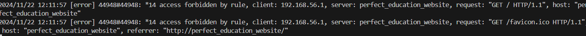

#### T3.2: Combine IP and User Authentication

Configure Nginx to require both a valid IP and user credentials (pew_both_credential_valid):

```nginx
server {
    listen 80;
    listen [::]:80;
    root /var/www/perfect_education_website/html;
    index index.html index.htm index.nginx-debian.html;
    server_name perfect_education_website;

    location / {
        satisfy all;
        allow 192.168.56.1;
        auth_basic "Restricted Area";
        auth_basic_user_file /etc/nginx/.htpasswd;
        try_files $uri $uri/ =404;
    }
}
```

- Successful access:
  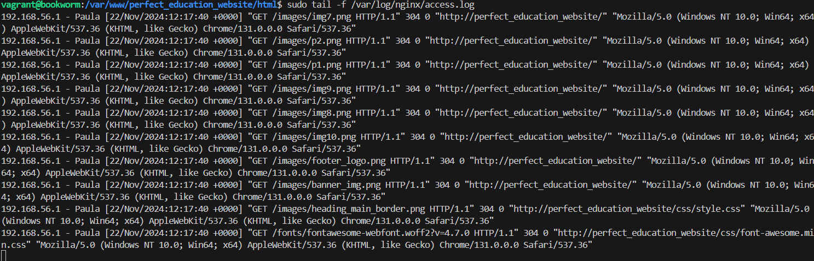

# Server Configuration Guide

### 8. Safe Access with Nginx

#### **Prerequisites**

Set up a DNS server with the following features:

- A record pointing `perfect-education.com` to your server's IP address.
- A record pointing `www.perfect-education.com` to your server's IP address.

#### **Steps**

1. **Install BIND9**

   ```bash
   sudo apt install bind9
   ```

2. **Modify the main config file**

   ```bash
   sudo nano /etc/bind/named.conf.local
   ```

   Add the following:

   ```bash
   zone "perfect-education.com" {
       type master;
       file "/etc/bind/db.perfect-education.com";
   };
   ```

3. **Create the zone file for the domain**

   ```bash
   sudo nano /etc/bind/db.perfect-education.com
   ```

   Paste the configuration below:

   ```text
   ; BIND data file for local loopback interface
   ;
   $TTL 6048000
   @ IN SOA perfect-education.com. admin-perfect.education.com. (
       2024112201 ; Serial
       604800 ; Refresh
       86400 ; Retry
       2419200 ; Expire
       604800 ) ; Negative Cache TTL

   @ IN NS perfect-education.com.
   perfect-education.com. IN A 192.168.56.10
   www.perfect-education.com. IN A 192.168.56.10
   ```

4. **Check configuration**
   Run the following commands to validate your DNS settings:

   ```bash
   sudo named-checkconf
   sudo named-checkzone perfect-education.com /etc/bind/db.perfect-education.com
   ```

   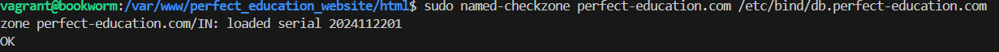
   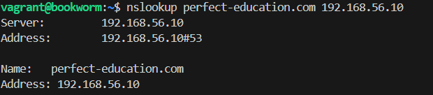

5. **Restart BIND**
   ```bash
   sudo systemctl restart bind9
   ```

#### 8.1 **Nginx Configuration**

1. Create the configuration file for your domain:

   ```bash
   sudo nano /etc/nginx/sites-available/example.com
   ```

2. Set the `server_name` directive:

   ```nginx
   server {
       ...
       server_name example.com www.example.com;
   }
   ```

3. Check and reload Nginx:
   ```bash
   sudo nginx -t
   sudo systemctl reload nginx
   ```
   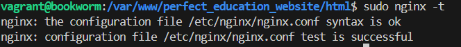

#### 8.2 **Firewall Configuration**

1. Install UFW:

   ```bash
   sudo apt install ufw
   ```

2. Enable and configure UFW:

   ```bash
   sudo ufw enable
   sudo ufw allow ssh
   sudo ufw allow 'Nginx Full'
   sudo ufw delete allow 'Nginx HTTP'
   ```

3. Check UFW status:
   ```bash
   sudo ufw status
   ```
   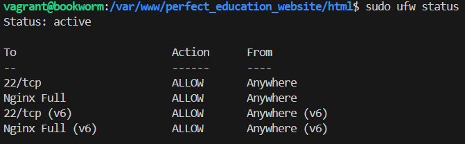

#### 8.3 **Certificate Generation**

Generate the SSL certificate:

```bash
sudo openssl req -x509 -nodes -days 365     -newkey rsa:2048     -keyout /etc/ssl/private/perfect-education.com.key     -out /etc/ssl/certs/perfect-education.com.crt
```

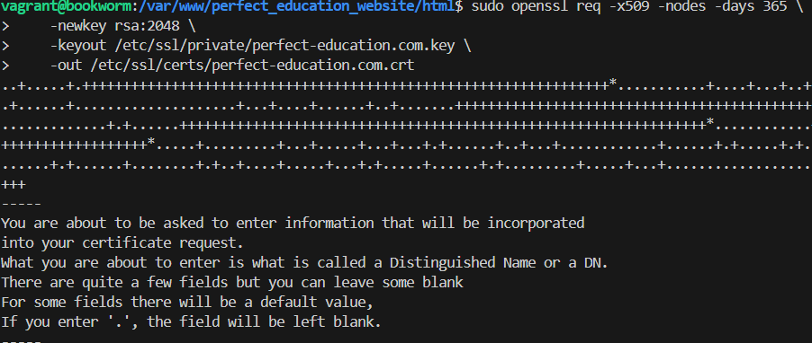

#### 8.4 **SSL Configuration**

Modify the Nginx config file to include SSL settings:

```nginx
server {
    listen 80;
    listen 443 ssl;
    root /var/www/perfect_education_website/html;
    index index.html index.htm index.nginx-debian.html;
    server_name perfect-education.com www.perfect-education.com;

    ssl_certificate /etc/ssl/certs/example.com.crt;
    ssl_certificate_key /etc/ssl/private/example.com.key;
    ssl_protocols TLSv1 TLSv1.1 TLSv1.2 TLSv1.3;
    ssl_ciphers HIGH:!aNULL:!MD5;

    location / {
        try_files $uri $uri/ =404;
    }
}
```

Check and reload Nginx:

```bash
sudo nginx -t
sudo systemctl reload nginx
```

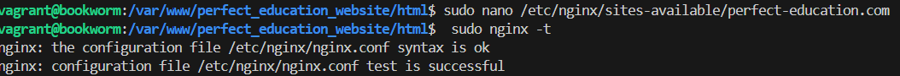

#### 8.5 **Verify Domain**

Access the following URLs to ensure proper configuration:

- http://perfect-education.com
- http://www.perfect-education.com


