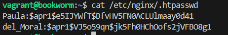
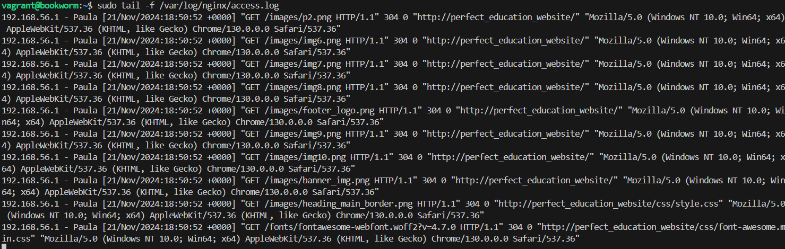
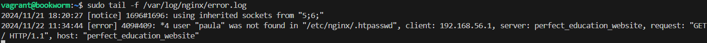
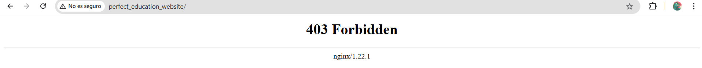
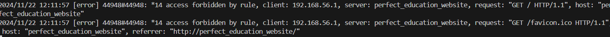
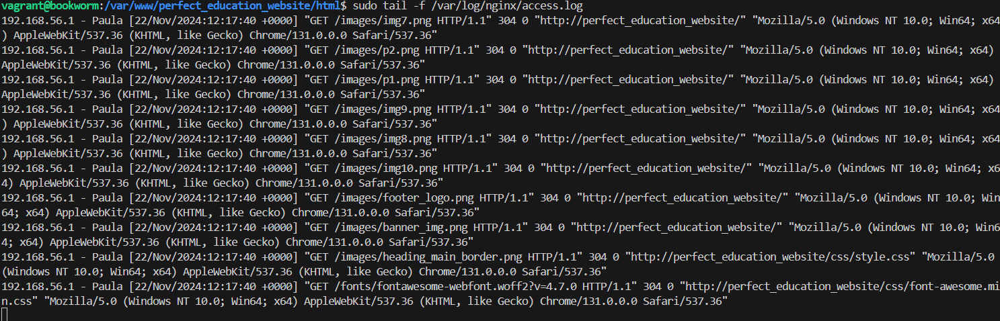

# Nginx Web Server and FTPS Configuration on Debian with Vagrant

## 📖 Overview

This repository provides a comprehensive guide for setting up a Debian-based Nginx web server and FTPS service within a Vagrant-managed virtual machine. The project includes:

- Setting up two websites (`my_site` and `new_site`) with Nginx.
- Secure file transfer using FTPS.
- Proper directory structure and permission configuration.
- Debugging logs and troubleshooting common issues.

## 📋 Requirements

Ensure the following tools are installed on your local machine:

- [Vagrant](https://www.vagrantup.com/)
- [VirtualBox](https://www.virtualbox.org/) (or another Vagrant-compatible provider)
- [Git](https://git-scm.com/) for cloning repositories

---

### 6️⃣ Authentication

#### 6.1 Install OpenSSL

Verify that OpenSSL is installed on your system:

```bash
dpkg -l | grep openssl
```

#### 6.2 Create Users and Passwords

1. Create a hidden `.htpasswd` file inside `/etc/nginx` to store users and passwords:

   ```bash
   sudo htpasswd -c /etc/nginx/.htpasswd
   ```

2. Create a user named `Paula`:

   ```bash
   sudo sh -c "echo -n 'Paula:' >> /etc/nginx/.htpasswd"
   ```

3. Generate a password for the user:

   ```bash
   sudo sh -c "openssl passwd -apr1 'yourpassword' >> /etc/nginx/.htpasswd"
   ```

Two users were created successfully and verified as follows:



#### 6.3 Modify the Server Block

Update the server block to include basic authentication:

```nginx
server {
    listen 80;
    listen [::]:80;
    root /var/www/perfect_education_website/html;
    index index.html index.htm index.nginx-debian.html;
    server_name perfect_education_website;

    location / {
        auth_basic "Área restringida";
        auth_basic_user_file /etc/nginx/.htpasswd;
        try_files $uri $uri/ =404;
    }
}
```

---

### 7️⃣ Tasks

#### T1: Test User Authentication

1. Attempt to log in with an incorrect user first, then with a valid user.

   - Successful access:
     
   - Access denied:
     

2. Verify the logs for access and error details using the following commands:

   ```bash
   sudo tail -f /var/log/nginx/access.log
   sudo tail -f /var/log/nginx/error.log
   ```

#### T2: Add Authentication for `contact.html`

Modify the server block to require authentication for `contact.html`:

```nginx
server {
    listen 80;
    listen [::]:80;
    root /var/www/perfect_education_website/html;
    index index.html index.htm index.nginx-debian.html;
    server_name perfect_education_website;

    location / {
        auth_basic "Area Restringida";
        auth_basic_user_file /etc/nginx/.htpasswd;
        try_files $uri $uri/ =404;

        location = /contact.html {
            auth_basic "Restricted Area";
            auth_basic_user_file /etc/nginx/.htpasswd;
        }
    }
}
```

---

#### T3.1: Restrict Access by IP

Configure Nginx to deny access from the host machine's IP to the website's root:

```nginx
server {
    listen 80;
    listen [::]:80;
    root /var/www/perfect_education_website/html;
    index index.html index.htm index.nginx-debian.html;
    server_name perfect_education_website;

    location / {
        satisfy all;
        deny 192.168.56.1;
        auth_basic "Restricted Area";
        auth_basic_user_file /etc/nginx/.htpasswd;
        try_files $uri $uri/ =404;

        location = /contact.html {
            auth_basic "Restricted Area";
            auth_basic_user_file /etc/nginx/.htpasswd;
        }
    }
}
```

- Host access denied:
  
  

#### T3.2: Combine IP and User Authentication

Configure Nginx to require both a valid IP and user credentials:

```nginx
server {
    listen 80;
    listen [::]:80;
    root /var/www/perfect_education_website/html;
    index index.html index.htm index.nginx-debian.html;
    server_name perfect_education_website;

    location / {
        satisfy all;
        allow 192.168.56.1;
        auth_basic "Restricted Area";
        auth_basic_user_file /etc/nginx/.htpasswd;
        try_files $uri $uri/ =404;
    }
}
```

- Successful access:
  
